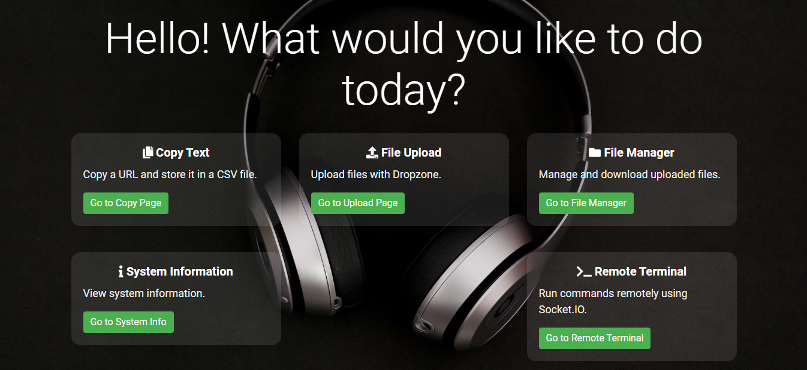
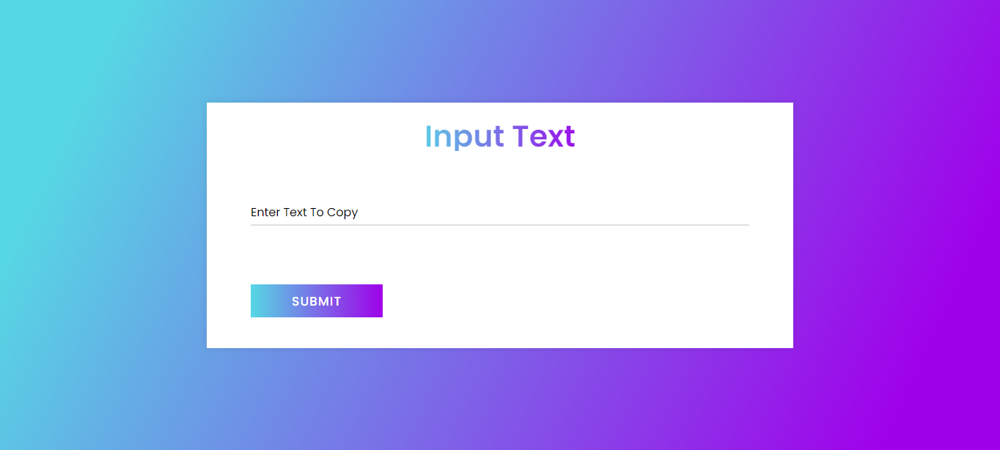
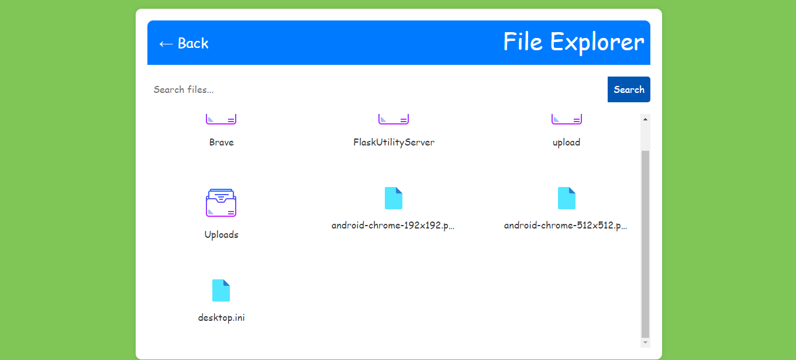
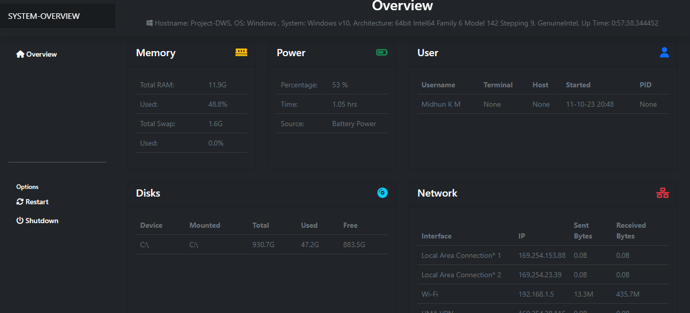
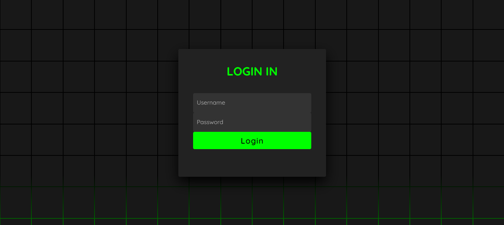
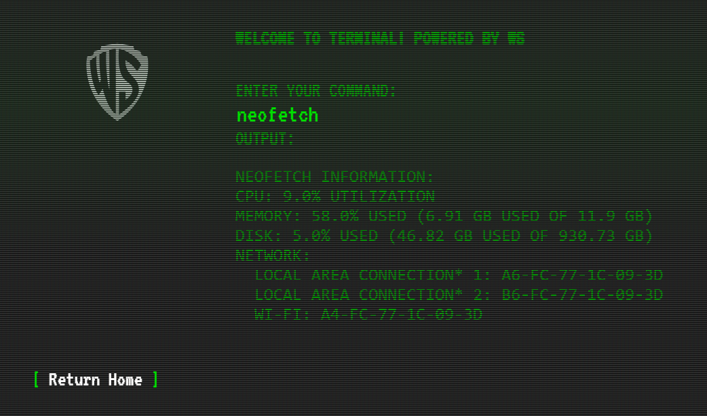
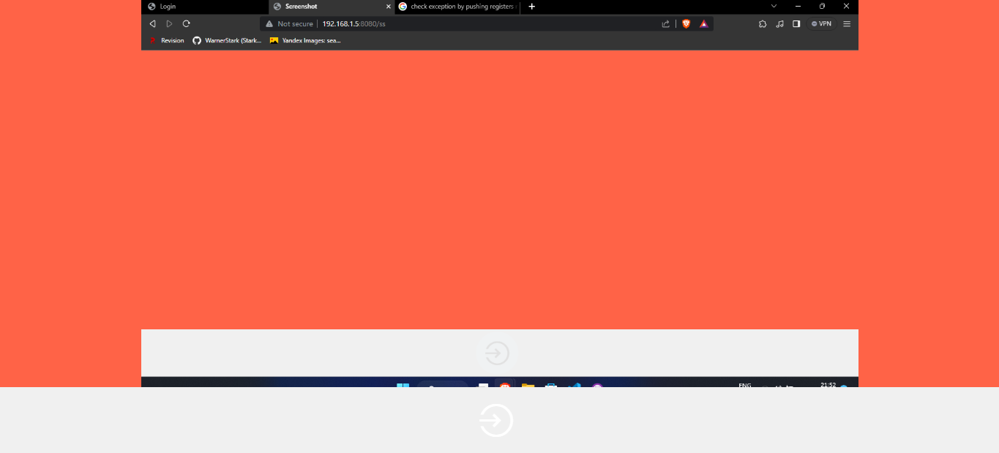

# Flask Utility Server 
## ~~No More fucking wires or third party apps~~

## Overview

This Flask application provides a convenient way to perform various tasks related to your network. From uploading files to your PC and downloading from it, to copying text to your PC from devices connected to your network, this app has got you covered. Additionally, it offers a feature to display information about devices, including details such as battery status, memory usage, and more.

## Table of Contents

- [Overview](#overview)
- [Features](#features)
- [Installation](#installation)
- [Contributing](#contributing)
- [License](#license)

## Features

1. **File Operations:**
   - Upload files to your PC.
   - Download files from your PC.

2. **Text Copy:**
   - Copy text to your PC from devices connected to your network.

3. **Device Information:**
   - View detailed information about devices on your network.
   - Information includes battery status, memory usage, and more.

4. **Execute Code:**
   - Run and execute code in main server using socketio

5. **Take Screenshots**
   - Taken screenshot of your main server / pc from other devices

## Dependencies

This project utilizes various dependencies to enhance its functionality. Special thanks to the developers of the following libraries:

- Flask: [Link to Flask](https://palletsprojects.com/p/flask/)
- Psutil: [Link to Psutil](https://psutil.readthedocs.io/)
- Other necessary dependencies

## Installation
1. Clone the repository:
```git clone https://github.com/your-username/network-utility-app.git```

3. Install dependencies:
```pip install -r requirements.txt```

5. Run the Flask application:
```python main.py```
or use ```uvicorn main:app``` btw Use uvicorn for production, who would you do that?

7. Access the app in your browser: [http://localhost:8080](http://localhost:8080) or check your host & port.

## Acknowledgments
Special thanks to the developers of the dependencies that make this project possible. Additionally, credit to [Psutil Dashboard](https://github.com/gopalcnepal/psutil-dashboard) for the device information template that inspired and facilitated the integration of Psutil in this app.

## Contributing
If you would like to contribute to this project, please read improvements section to know what needs to be improved in this project

## License
This project is licensed under the GNUV3 License - see the [LICENSE](LICENSE) file for details.
Happy networking!


# Screenshots

## Here are some screenshots:

Index page


Copy from Server to clipboard


File Explorer


System Info



Login Page


Terminal


Screenshot Capture



## Improvements
   - Requires some improvements in styling
   - Add more secure login system & do bug hunting
   - Improve speeds
   - Optimize pages for other platforms